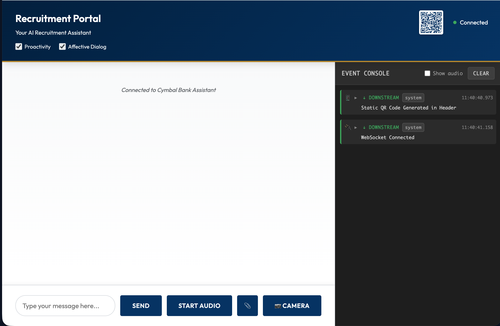

# Cymbal Bank Recruitment Assistant

A multimodal voice assistant designed for **Cymbal Bank, India**. This application leverages **Google's Agent Development Kit (ADK)** and the **Gemini 2.5 Flash Native Audio** model to provide real-time, bidirectional voice interactions for recruitment and HR queries.



## 🌟 Domain Solution: Hybrid Recruitment Agent

The Cymbal Bank Recruitment Assistant is a comprehensive AI solution for modernizing the candidate experience. It combines conversational AI with structured data capture and document management to streamline the recruitment funnel.

### Core Capabilities
-   **Intelligent Policy Search**: Real-time answers to employee and candidate queries (e.g., maternity leave, medical insurance) using **Vertex AI Search** indexed over official PDF policies.
-   **Sequential Education Extraction**: Automatically extracts multiple educational qualifications (e.g., 10th, 12th, Bachelor's, Master's) from a single resume and stores them as an additive history.
-   **Multi-Format Document Support**: Seamlessly processes **PDF, JPEG, PNG**, and **Microsoft Word (.docx, .doc)** documents for resume and identification extraction.
-   **Robust Deep-Merge Persistence**: Implements sophisticated JSON merging in **Google Cloud BigTable**, ensuring that new document uploads (like a PAN card) never overwrite or lose previously captured resume data.
-   **Real-time Candidate Profile**: A dedicated transparent UI tab that fetches and renders the candidate's full history, including downloaded document links and multiple qualification blocks.
-   **Multimodal Interaction**: Supports high-fidelity voice (Native Audio), text, and image/camera interactions with the Gemini-powered sub-agent.

---

## 🛠️ Technology Stack

| Layer | Technology |
| :--- | :--- |
| **Generative AI** | Gemini 2.5 Flash (Native Audio) via Multimodal Live API |
| **Agent Framework** | Google Agent Development Kit (ADK) |
| **Knowledge Engine** | Vertex AI Search (RAG over PDF policies) |
| **Database** | Google Cloud BigTable (for structured application data) |
| **Storage** | Google Cloud Storage (for uploaded documents) |
| **Backend** | Python 3.11, FastAPI, WebSockets |
| **Frontend** | Vanilla HTML5 / Modern CSS (Glassmorphism) / Vanilla JS |
| **Deployment** | Google Cloud Run (Mumbai Region: `asia-south1`) |

---

## 🌐 Hosted Solution Endpoints

Access the live recruitment portal and backend services at the following URLs:

-   **Candidate Portal (Frontend)**: [https://recruitment-agent-frontend-787798151876.asia-south1.run.app](https://recruitment-agent-frontend-787798151876.asia-south1.run.app)
-   **API Backend**: [https://recruitment-agent-backend-787798151876.asia-south1.run.app](https://recruitment-agent-backend-787798151876.asia-south1.run.app)
-   **GCS Document Storage**: `gs://learn-361304-recruitment-uploads`

---

## 🚀 Deployment & Infrastructure Guide

### 1. Project Infrastructure Setup

Run the provided automation scripts to provision the necessary Google Cloud resources in the Mumbai region (`asia-south1`):

```bash
export GOOGLE_CLOUD_PROJECT=your-project-id

# 1. Setup Vertex AI Search (Global/Location specific)
./scripts/setup_vertex_search.sh

# 2. Setup BigTable (Table: job_applications, Family: cf1)
./scripts/setup_bigtable.sh

# 3. Setup GCS Uploads Bucket
./scripts/setup_uploads.sh
```

### 2. Environment Configuration

Create an `app/.env` file with the following critical variables:

```bash
# Core Configuration
GOOGLE_CLOUD_PROJECT=learn-361304
GOOGLE_CLOUD_LOCATION=us-central1 # Model location for Native Audio
DEMO_AGENT_MODEL=gemini-live-2.5-flash-native-audio

# Vertex AI Search
DATA_STORE_ID=recruitment-policies-ds
SEARCH_LOCATION=global

# Storage & Database
UPLOADS_BUCKET=learn-361304-recruitment-uploads
BIGTABLE_INSTANCE=recruitment-instance
```

### 3. Cloud Run Deployment

**Deploy the Backend:**
```bash
gcloud run deploy recruitment-agent-backend \
  --source . \
  --region asia-south1 \
  --allow-unauthenticated \
  --set-env-vars GOOGLE_GENAI_USE_VERTEXAI=TRUE,DEMO_AGENT_MODEL=gemini-live-2.5-flash-native-audio,GOOGLE_CLOUD_PROJECT=learn-361304,GOOGLE_CLOUD_LOCATION=us-central1,DATA_STORE_ID=recruitment-policies-ds,SEARCH_LOCATION=global,ALLOWED_ORIGINS="*"
```

**Deploy the Frontend:**
```bash
# Prepare the static bundle
mkdir -p frontend/app && cp -r app/static frontend/app/static

gcloud run deploy recruitment-agent-frontend \
  --source ./frontend \
  --region asia-south1 \
  --allow-unauthenticated
```
